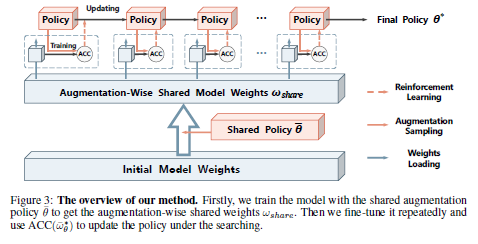

# Improving Auto-Augment via Augmentation-Wise Weight Sharing
Unofficial [AWS AutoAugment](https://arxiv.org/abs/2009.14737) implementation in PyTorch.

- AWS AutoAugment learns augmentation policies using augmentation-wise shared model weights


<p align="center">

</p>

## To-do
### Essentials
- [x] Baseline structure
- [x] Augmentation list
- [x] Shared policy
- [x] Augmentation-wise shared model weights
- [x] PPO + baseline trick
- [x] Search code
- [x] Training code
- [x] Enlarge Batch (EB)
- [ ] CIFAR100 WRN 
- [ ] CIFAR100 Shake-Shake
- [ ] CIFAR100 PyramidNet+ShakeDrop

### Possible Modification
- [ ] Faster action recorder with pickle (currently using txt)
- [ ] Distributed training (currently using nn.DataParallel)
- [ ] Search with EB
- [ ] Random Search
- [ ] Policy Gradient
- [ ] Stocastic Depth 
- [ ] CIFAR10 
- [ ] ImageNet

### Future Works
- [ ] Incremental Searching with Operation Embedding Sharing (CIFAR10 -> CIFAR100 -> ImageNet)
- [ ] FastAugment + AWS
- [ ] ProxylessNAS + AWS
- [ ] Gradient-basedNAS + AWS

## Results

### CIFAR 100

Search : **150 ~ 240 GPU Hours**, WResNet-28-10 on CIFAR100 


| Model(CIFAR-100)      | Baseline   | Cutout     | AWSAugment  |   AWS + EB |
|-----------------------|------------|------------|-------------|------------|
| Wide-ResNet-28-10     |     -      |     -      |      -      |     -      | 
| Shake-Shake(26 2x32d) |     -      |     -      |      -      |     -      | 
| PyramidNet+ShakeDrop  |     -      |     -      |      -      |     -      | 
## Run

We conducted experiments under

- python 3.7.0
- pytorch 1.6.0, torchvision 0.5.0, cuda10

### Search a augmentation policy

```
$ python AWSAutoAugment/search.py --path ... --dataroot ...
```

### Train a model with found policies

```
$ python AWSAutoAugment/train.py --path ... --dataroot ... --policy_checkpoint ... 

$ python AWSAutoAugment/train.py --path ... --dataroot ... --policy_checkpoint ... --model wresnet28_10 --no_aug --cutout 0

$ python AWSAutoAugment/train.py --path ... --dataroot ... --policy_checkpoint ... --model wresnet28_10 --no_aug --cutout 16

$ python AWSAutoAugment/train.py --path ... --dataroot ... --policy_checkpoint ... --model wresnet28_10

$ python AWSAutoAugment/train.py --path ... --dataroot ... --policy_checkpoint ... --model wresnet28_10 --enlarge_batch

$ python AWSAutoAugment/train.py --path ... --dataroot ... --policy_checkpoint ... --model shakeshake26_2x32d --batch_size 128 --n_epochs 1800 --init_lr 0.01 --weight_decay 0.001

$ python AWSAutoAugment/train.py --path ... --dataroot ... --policy_checkpoint ... --model pyramid --batch_size 64 --n_epochs 1800 --init_lr 0.05 --weight_decay 0.00005
```

## References & Opensources

We increase the batch size and adapt the learning rate accordingly to boost the training. Otherwise, we set other hyperparameters equal to AutoAugment if possible. For the unknown hyperparameters, we follow values from the original references or we tune them to match baseline performances.

- **ResNet** : [paper1](https://arxiv.org/abs/1512.03385), [paper2](https://arxiv.org/abs/1603.05027), [code](https://github.com/osmr/imgclsmob/tree/master/pytorch/pytorchcv/models)
- **PyramidNet** : [paper](https://arxiv.org/abs/1610.02915), [code](https://github.com/dyhan0920/PyramidNet-PyTorch)
- **Wide-ResNet** : [code](https://github.com/meliketoy/wide-resnet.pytorch)
- **Shake-Shake** : [code](https://github.com/owruby/shake-shake_pytorch)
- **ShakeDrop Regularization** : [paper](https://arxiv.org/abs/1802.02375), [code](https://github.com/owruby/shake-drop_pytorch)
- **AutoAugment** : [code](https://github.com/tensorflow/models/tree/master/research/autoaugment)
- **Fast AutoAugment** : [code](https://github.com/kakaobrain/fast-autoaugment)
- **NASNet** : [code](https://github.com/MarSaKi/nasnet)